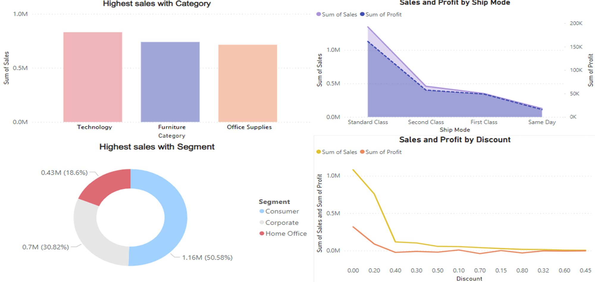
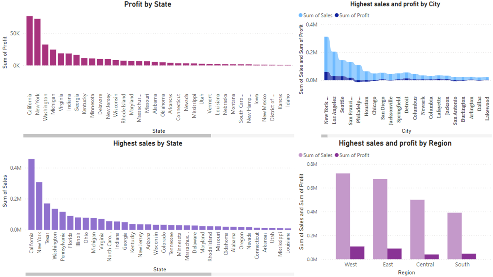

# Business-Intelligence-Project
Walmart Sales Problem 
 - I applied data exploration methods (i.e., summary statistics and visualization methods)
 - Made data cleaning or transformation method (i.e. Handle missing values, remove duplicates, handle outliers, etc.)
 - Visualized the dataset using PowerBI: 
 
 
 - Developed and evaluated a machine learning model in predicting sales of the Walmart.
 - Made a time series for the sales of Walmart. It is between column sales and Order Date.